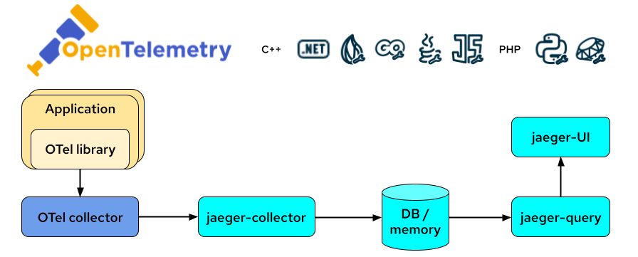
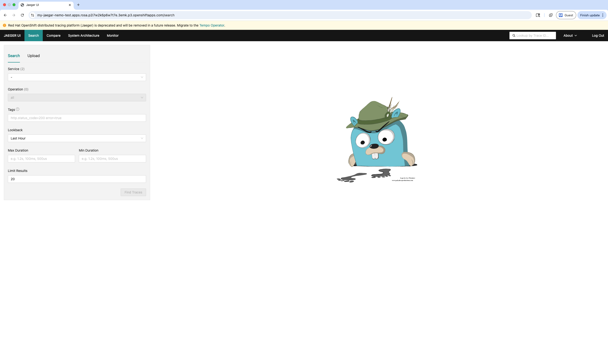

# Configuring the OpenTelemetry Collector
This tutorial shows how to configure OpenTelemetry and Jaegar to gather insights on your application/service.

## How OpenTelemetry and Jaegar Work Together
**OpenTelemetry** - aims to provide APIs and SDKs in multiple languages to allow applications to export various telemetry data out of the process, to any number of metrics and tracing backends

**Jaegar** - tracing backend that receives tracing telemetry data and provides processing, aggregation, data mining, and visualizations of that data

This diagram depicts how telemetry data flows between your application, OpenTelemetry, Jaegar.



## OpenTelemetry Collector Configuration Options
The OpenTelemetry Collector consists of the following 5 components, each with their own set of configurable parameters:

* Receivers - how data gets into the Collector
* Processors - process the data before it is exported
* Exporters - send data to one or more backends
* Connectors - join pairs of pipelines
* Extensions - optional components for tasks that do not involve processing telemetry data

## Pre-requisites

* Install the Red Hat OpenShift distributed tracing platform (Jaegar)
* Install the Red Hat build of OpenTelemetry


1. Create a new project, for example, `my-otel-demo`
    ```
    oc create project my-otel-demo
    ```

2. Create a Jaegar instance

    ```
    $ cat <<EOF |oc apply -f -
    apiVersion: jaegertracing.io/v1
    kind: Jaeger
    metadata:
    name: my-jaeger
    spec: {}
    EOF
    ```

3. Sanity check the Jaegar instance by checking the route:
    ```
    oc get routes my-jaeger
    ```
    Open a new browser window and go to the route URL and login with your OpenShift credentials. You should see the following UI:

    

4. Sanity check the list of Jaegar services:
   ```
   oc get svc | grep jaegar
   ```

   Expected output:
   ```
   my-jaegar-agent                            ClusterIP      None             <none>                                                5775/UDP,5778/TCP,6831/UDP,6832/UDP,14271/TCP                        144m
    my-jaegar-collector                        ClusterIP      172.30.243.189   <none>                                                9411/TCP,14250/TCP,14267/TCP,14268/TCP,14269/TCP,4317/TCP,4318/TCP   144m
    my-jaegar-collector-headless               ClusterIP      None             <none>                                                9411/TCP,14250/TCP,14267/TCP,14268/TCP,14269/TCP,4317/TCP,4318/TCP   144m
    my-jaegar-query                            ClusterIP      172.30.237.229   <none>                                                443/TCP,16685/TCP,16687/TCP                                          144m
   ```

5. Create the OpenTelemetry Collector:

   ```
    kind: OpenTelemetryCollector
    apiVersion: opentelemetry.io/v1beta1
    metadata:
    name: my-otelcol
    namespace: nemo-test
    spec:
    config:
        exporters:
            debug: {}
            otlp:
                # gRPC server serving on port 4317
                endpoint: "my-jaegar-collector-headless.nemo-test.svc.cluster.local:4317"
                # by default, this server does not use TLS
                tls:
                    insecure: true
                    insecure_skip_verify: true
        receivers:
        otlp:
            protocols:
            grpc: {}
            http: {}
        service: <1>
            pipelines:
                traces:
                exporters:
                    - debug
                    - otlp
                receivers:
                    - otlp
    mode: deployment
    resources: {}
    targetAllocator: {}
   ```
    <1> If a component is configured but not defined in the service section, it will not be enabled

6. Sanity check the OpenTelemetry Collector instance by checking the pods' logs

    (a) Retreive the OpenTelemetry pods:

        oc get pods | grep my-otelcol

     Expected output:

        my-otelcol-collector-77d97c47f6-gnqvm               1/1     Running            0               4h32m
        my-otelcol-tls-test-collector-54b4cd6c7d-d965l      1/1     Running            0               4h9m


    (b) Retreive the logs for `my-otel-collector-xxx`:

        oc logs my-otelcol-collector-77d97c47f6-gnqvm -c otc-container


    Expected output:
    ```
    ...
    2025-07-31T13:17:05.411Z        info    service@v0.127.0/service.go:289 Everything is ready. Begin running and processing data. {"resource": {}}
    ```

7. Once you verify that your Jaegar and OpenTelemetry instance are working as expected, you can add logic into your application to send telemetry data to the OpenTelemetry Collector.

## References
[1] [Using OpenTelemetry and Jaegar with Your Own Services/Application](https://github.com/rbaumgar/otelcol-demo-app/blob/main/OpenTelemetry.md)

[2] [Red Hat Build of OpenTelemetry, Chapter 3. Configuring the Collector](https://docs.redhat.com/en/documentation/openshift_container_platform/4.15/html/red_hat_build_of_opentelemetry/configuring-the-collector#otel-configuration-of-otel-collector)
